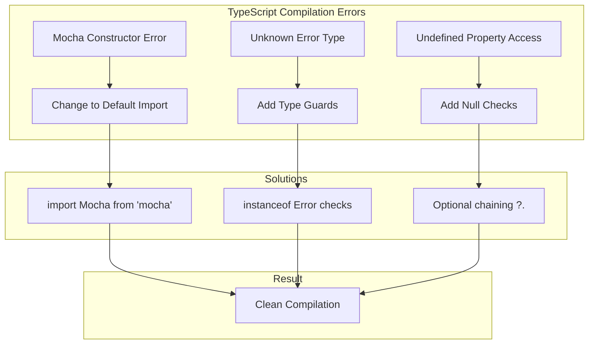

# Design Document

## Overview

The TypeScript compilation errors are preventing the VS Code extension from building successfully. The errors fall into three main categories:

1. **Mocha Import Issues**: The current namespace import syntax doesn't support constructor calls
2. **Error Type Safety**: Caught errors are typed as `unknown` and need proper type guards
3. **Undefined Property Access**: Properties that might be undefined need null-safe access patterns

**Root Cause Analysis:**
- `import * as Mocha from 'mocha'` creates a namespace import that can't be constructed
- Modern TypeScript strict mode treats caught errors as `unknown` type for safety
- Strict null checks flag potentially undefined property access

**Solution Approach:**
1. Fix Mocha imports to use default import or require syntax
2. Add proper error type guards and assertions
3. Implement null-safe property access patterns
4. Ensure all changes maintain test functionality

## Architecture

### Error Categories and Solutions



### File-Specific Issues and Fixes

**src/test/run-webview-tests.ts:**
- Line 2: Change namespace import to default import
- Line 12: Fix Mocha constructor call
- Line 43: Add type annotation for failures parameter

**src/test/webview-error-handling.test.ts:**
- Line 359: Add error type guard for error.message access

**src/test/webview-panel.test.ts:**
- Line 136: Add null check for panelStats.uptime
- Lines 271, 296, 323: Add error type guards for error.message access

## Components and Interfaces

### 1. Mocha Import Fix

**Current Problematic Code:**
```typescript
import * as Mocha from 'mocha';
// ...
const mocha = new Mocha({  // Error: not constructable
```

**Fixed Implementation:**
```typescript
// Option 1: Default import (recommended)
import Mocha from 'mocha';

// Option 2: Require syntax (alternative)
const Mocha = require('mocha');

// Usage (both options work)
const mocha = new Mocha({
    ui: 'tdd',
    color: true,
    timeout: 10000
});
```

### 2. Error Type Guard Utility

**Purpose**: Safely handle caught errors with proper typing

**Implementation:**
```typescript
// Utility function for error type checking
function isError(error: unknown): error is Error {
    return error instanceof Error;
}

// Alternative: More comprehensive error guard
function getErrorMessage(error: unknown): string {
    if (error instanceof Error) {
        return error.message;
    }
    if (typeof error === 'string') {
        return error;
    }
    return 'Unknown error occurred';
}

// Usage in catch blocks
try {
    // some operation
} catch (error) {
    if (isError(error)) {
        console.warn('Operation failed:', error.message);
    } else {
        console.warn('Operation failed:', getErrorMessage(error));
    }
}
```

### 3. Null-Safe Property Access

**Purpose**: Handle potentially undefined properties safely

**Implementation Patterns:**

**Option 1: Optional Chaining (TypeScript 3.7+)**
```typescript
// Instead of: panelStats.uptime >= 0
// Use: panelStats.uptime?.valueOf() >= 0
assert.strictEqual(panelStats.uptime != null && panelStats.uptime >= 0, true, 'Panel uptime should be non-negative');
```

**Option 2: Explicit Null Check**
```typescript
// Check for undefined before access
if (panelStats.uptime !== undefined) {
    assert.strictEqual(panelStats.uptime >= 0, true, 'Panel uptime should be non-negative');
} else {
    assert.fail('Panel uptime is undefined');
}
```

**Option 3: Default Value Pattern**
```typescript
// Provide default value for undefined properties
const uptime = panelStats.uptime ?? -1;
assert.strictEqual(uptime >= 0, true, 'Panel uptime should be non-negative');
```

### 4. Type-Safe Test Runner Configuration

**Purpose**: Ensure test runner callback has proper types

**Implementation:**
```typescript
import Mocha from 'mocha';

export function runTests(): Promise<void> {
    return new Promise((resolve, reject) => {
        const mocha = new Mocha({
            ui: 'tdd',
            color: true,
            timeout: 10000
        });

        // Add test files
        const testsRoot = path.resolve(__dirname, '..');
        // ... file discovery logic

        try {
            // Run tests with properly typed callback
            mocha.run((failures: number) => {
                if (failures > 0) {
                    reject(new Error(`${failures} tests failed.`));
                } else {
                    resolve();
                }
            });
        } catch (error) {
            reject(error);
        }
    });
}
```

## Data Models

### Error Handling Types

```typescript
// Type guard for Error objects
type ErrorLike = {
    message: string;
    name?: string;
    stack?: string;
};

// Union type for error handling
type CatchableError = Error | ErrorLike | string | unknown;

// Test result types
interface TestResult {
    failures: number;
    passes: number;
    total: number;
}

// Panel stats with optional properties
interface PanelStats {
    uptime?: number;
    isVisible: boolean;
    isReady: boolean;
}
```

### Mocha Configuration

```typescript
interface MochaOptions {
    ui: 'tdd' | 'bdd' | 'qunit';
    color: boolean;
    timeout: number;
    reporter?: string;
    grep?: string;
}
```

## Error Handling

### Compilation Error Prevention

**Type Safety Patterns:**
1. Always use type guards for caught errors
2. Check for undefined before property access
3. Use proper import syntax for external modules
4. Provide type annotations for callback parameters

**Error Recovery Strategies:**
1. Graceful fallbacks for undefined properties
2. Default values for missing configuration
3. Comprehensive error messages for debugging
4. Proper error propagation in async operations

### Testing Error Scenarios

**Error Type Handling:**
```typescript
// Test error handling with different error types
suite('Error Handling Tests', () => {
    test('should handle Error objects', () => {
        try {
            throw new Error('Test error');
        } catch (error) {
            assert.strictEqual(isError(error), true);
            if (isError(error)) {
                assert.strictEqual(error.message, 'Test error');
            }
        }
    });

    test('should handle string errors', () => {
        try {
            throw 'String error';
        } catch (error) {
            assert.strictEqual(getErrorMessage(error), 'String error');
        }
    });

    test('should handle unknown errors', () => {
        try {
            throw { custom: 'object' };
        } catch (error) {
            assert.strictEqual(getErrorMessage(error), 'Unknown error occurred');
        }
    });
});
```

## Testing Strategy

### Compilation Verification

**Build Process Testing:**
1. Run `npm run compile` and verify no TypeScript errors
2. Check that all .js files are generated in out/ directory
3. Verify .js.map source maps are created correctly
4. Ensure no type checking warnings in output

**Package Testing:**
1. Run `vsce package` and verify successful .vsix creation
2. Test extension installation from generated package
3. Verify all functionality works after packaging
4. Check that no runtime errors occur from type issues

### Manual Testing Steps

1. **Fix Mocha Import**:
   - Change import statement in run-webview-tests.ts
   - Verify Mocha constructor works without errors
   - Test that test runner executes successfully

2. **Fix Error Handling**:
   - Add type guards to all catch blocks
   - Test error scenarios to ensure proper handling
   - Verify error messages are accessible

3. **Fix Property Access**:
   - Add null checks for potentially undefined properties
   - Test with both defined and undefined values
   - Verify assertions work correctly

### Automated Testing

```typescript
// Test compilation success
suite('TypeScript Compilation Tests', () => {
    test('should compile without errors', async () => {
        const result = await execAsync('npm run compile');
        assert.strictEqual(result.stderr, '', 'No compilation errors expected');
    });

    test('should package successfully', async () => {
        const result = await execAsync('vsce package --out test.vsix');
        assert.strictEqual(result.exitCode, 0, 'Package should succeed');
    });
});
```

## Security Considerations

### Type Safety
- Proper error type checking prevents runtime type errors
- Null checks prevent undefined property access crashes
- Strict TypeScript configuration catches potential issues early

### Import Security
- Use proper module imports to avoid prototype pollution
- Validate external module interfaces match expected types
- Ensure test dependencies don't introduce vulnerabilities

## Performance Considerations

### Compilation Performance
- Minimize type checking overhead with efficient type guards
- Use TypeScript's built-in type narrowing where possible
- Avoid complex type computations in frequently called code

### Runtime Performance
- Type guards add minimal runtime overhead
- Null checks are fast boolean operations
- Proper imports don't affect runtime performance