# Design Document

## Overview

The VSS (Visual Sketch Sync) system is a **three-way synchronization platform** that keeps a drawing canvas, VS Code editor, and live Chrome application in perfect sync. The system consists of:

1. **VS Code Extension**: Provides a pressure-sensitive drawing canvas with professional design tools
2. **Live Chrome Application**: Running React app with Redux DevTools and React DevTools integration
3. **Three-Way Sync Server**: Coordinates changes between all three environments
4. **Cross-Platform Support**: Works on desktop, iPad, and GitHub Codespaces

**The Three Sync Points**:
- **Drawing Canvas**: Visual design with tablets/stylus → generates CSS/components
- **VS Code Editor**: Code editing → updates canvas and live app
- **Chrome Application**: Live app with DevTools → updates code and canvas

**Bidirectional Flow**: Changes in any environment instantly update the other two

## Architecture

### Three-Way Sync Architecture

```mermaid
graph TB
    subgraph "VS Code Environment"
        subgraph "Editor Pane"
            ReactFiles[React/CSS Files]
            ConfigFiles[Config Files]
        end
        
        subgraph "Drawing Canvas"
            DrawingTools[Drawing Tools]
            ColorPalette[Color System]
            AlignmentGuides[CRAP Helpers]
        end
    end
    
    subgraph "Chrome Browser"
        subgraph "Live Application"
            ReactApp[Running React App]
            ReactDevTools[React DevTools]
            ReduxDevTools[Redux DevTools]
        end
        
        subgraph "Browser DevTools"
            ElementsPanel[Elements Panel]
            ConsolePanel[Console]
            NetworkPanel[Network]
        end
    end
    
    subgraph "Three-Way Sync Server"
        SyncCoordinator[Sync Coordinator]
        FileWatcher[File System Watcher]
        CodeGenerator[Code Generator]
        LiveReload[Live Reload Server]
    end
    
    %% Three-way connections
    ReactFiles <--> SyncCoordinator
    DrawingTools <--> SyncCoordinator
    ReactApp <--> SyncCoordinator
    
    %% DevTools integration
    ReactDevTools <--> SyncCoordinator
    ReduxDevTools <--> SyncCoordinator
    ElementsPanel <--> SyncCoordinator
    
    %% File system monitoring
    FileWatcher --> SyncCoordinator
    SyncCoordinator --> CodeGenerator
    SyncCoordinator --> LiveReload
```



### System Components Breakdown

**1. VS Code Extension (`extension.js`) - Maximizes Built-in APIs**
- Uses VS Code Webview API for drawing panel
- Uses VS Code File System Watcher for file monitoring  
- Uses VS Code Debug API for Chrome DevTools connection (existing!)
- Uses VS Code Live Server extension for hot reload (existing!)
- Uses VS Code Task API for running sync processes (existing!)
- Uses VS Code Terminal API for server management (existing!)
- **Minimal Custom**: Basic drawing canvas setup in webview

**2. Design Panel Webview - Leverages Web Standards**
- Uses HTML5 Canvas with **Pointer Events API** (web standard for tablets)
- Uses **CSS Color API** for color management (web standard)
- Uses **Web Components** for drawing tools (web standard)
- Uses **CSS Grid/Flexbox** for alignment guides (web standard)
- Uses VS Code Webview **postMessage API** for communication (existing!)
- **Minimal Custom**: Drawing tool logic and canvas state management

**3. Background Sync Server (`scripts/kiro-sync-server.js`)**
- Runs as separate Node.js process
- Watches file system for changes
- Handles WebSocket communication with webview
- Performs AST manipulation for code updates

**4. Code Generation System**
- CSS generator: Converts drawn shapes to CSS classes
- Design token generator: Creates CSS custom properties from color palette
- Component template generator: Creates React/HTML components from complex designs
- Asset exporter: Exports drawings as SVG/PNG for use in projects

### What VS Code Provides vs What We Build

**Leveraging VS Code Built-in Capabilities:**
- **Webview API**: Host our drawing canvas in VS Code panel
- **File System Watcher**: Monitor file changes (built-in `vscode.workspace.createFileSystemWatcher`)
- **Extension Host**: Runtime environment for our extension
- **Command Palette**: Register VSS commands (`vscode.commands.registerCommand`)
- **Settings API**: Extension configuration (`vscode.workspace.getConfiguration`)
- **Cross-platform**: VS Code handles desktop/web/mobile deployment

**Leveraging More VS Code Built-ins:**
- **Live Server**: Use VS Code Live Server extension for hot reload (existing)
- **Debugger API**: Use VS Code's Chrome debugger for DevTools integration (existing)
- **Task API**: Use VS Code tasks for running sync processes (existing)
- **Terminal API**: Use integrated terminal for server processes (existing)
- **Extension Host Communication**: Use VS Code's message passing (existing)

**Minimal Custom Implementation:**
- **Drawing Canvas**: HTML5 Canvas in webview (minimal - just drawing surface)
- **Tablet Input**: Pointer Events API (web standard, not custom)
- **Three-Way Sync Logic**: Coordinate changes between existing VS Code APIs
- **Chrome DevTools Bridge**: Use VS Code's existing Chrome debugger protocol

### Three-Way Sync Flows

**1. Drawing Canvas → Code → Live App**:
1. Designer draws rectangle with blue fill in canvas
2. Sync server generates CSS class `.button { background: blue; }`
3. VS Code editor shows updated CSS file
4. Live Chrome app hot-reloads with new button style
5. React DevTools shows updated component props

**2. VS Code Editor → Canvas → Live App**:
1. Developer changes CSS `.button { background: red; }`
2. File watcher detects change
3. Drawing canvas updates rectangle fill to red
4. Live Chrome app hot-reloads with red button
5. Chrome DevTools Elements panel shows updated styles

**3. Chrome DevTools → Code → Canvas**:
1. Developer changes element style in Chrome DevTools
2. DevTools extension captures change via Chrome API
3. Sync server updates VS Code CSS file
4. Drawing canvas updates visual representation
5. File system reflects the change

**4. React/Redux DevTools → Code → Canvas**:
1. Developer modifies component props in React DevTools
2. Props change captured via DevTools protocol
3. Sync server updates React component file
4. VS Code shows updated component code
5. Drawing canvas reflects new component structure

## Project Structure and Files

### VS Code Extension Files (Published as extension)
```
visual-sketch-sync-extension/
├── package.json              # Extension manifest with tablet support
├── extension.js              # Main extension entry point
├── webview/
│   ├── index.html           # Drawing canvas HTML
│   ├── drawing-engine.js    # WebGL/Canvas2D drawing engine
│   ├── pressure-input.js    # Wacom/Apple Pencil input handling
│   ├── drawing-tools.js     # Brush, pen, shape tools
│   ├── color-system.js      # Color palette and swatches
│   ├── alignment-guides.js  # CRAP design helpers
│   └── styles.css           # Canvas and UI styling
└── templates/
    ├── vss-sync-server.js   # Template for sync server
    └── design-tokens.css    # CSS design token templates
```

### Generated Project Files (Created in user's project)
```
my-project/
├── package.json              # Modified with sync scripts
├── scripts/
│   └── vss-sync-server.js   # Generated sync server
├── src/
│   ├── design/
│   │   ├── drawings/        # SVG/Canvas exports from drawings
│   │   ├── design-tokens.css # Generated color/spacing tokens
│   │   ├── components.css   # Generated component styles
│   │   └── design-data.json # Drawing canvas state
│   ├── styles/
│   │   ├── colors.css       # Generated from color palette
│   │   ├── layout.css       # Generated from alignment guides
│   │   └── components.css   # Generated component styles
│   └── components/
│       └── GeneratedButton.jsx # Components from drawn shapes
└── .vscode/
    └── settings.json        # VS Code workspace settings
```

### Runtime Architecture & Cross-Platform Support

**Desktop VS Code (Windows/Mac/Linux)**:
- Extension runs in VS Code extension host
- Drawing canvas in webview with Wacom tablet support
- Sync server as local Node.js process

**iPad with VS Code (via browser or app)**:
- Extension runs in VS Code web or app
- Drawing canvas with Apple Pencil pressure sensitivity
- Sync server via GitHub Codespaces or remote development

**GitHub Codespaces/Remote Development**:
- Extension runs in remote VS Code instance
- Drawing canvas streams to local browser/iPad
- Sync server runs in Codespace container

**Input Device Support**:
- **Wacom tablets**: Full pressure sensitivity and tilt detection
- **Apple Pencil**: Pressure, tilt, and palm rejection
- **Mouse/trackpad**: Basic drawing functionality
- **Touch screens**: Multi-touch gesture support

## Components and Interfaces

### 1. VS Code Extension (extension.js)

**Purpose**: Main extension entry point that manages the drawing canvas and cross-platform input

**Key Responsibilities**:
- Register drawing canvas webview and commands
- Detect and configure tablet/stylus input devices
- Handle cross-platform compatibility (desktop, iPad, Codespaces)
- Manage drawing canvas lifecycle and settings

**Interface**:
```javascript
function activate(context) {
  // Register drawing canvas webview provider
  // Detect input devices (Wacom, Apple Pencil)
  // Start sync server process
  // Set up cross-platform input handling
}

class DrawingCanvasProvider {
  resolveWebviewView(webviewView, context, token)
  setupInputDevices()
  handlePressureSensitivity()
}
```

### 2. Drawing Engine (webview/drawing-engine.js)

**Purpose**: Core drawing functionality with pressure sensitivity and professional tools

**Key Responsibilities**:
- WebGL/Canvas2D rendering for smooth drawing
- Pressure-sensitive brush and pen tools
- Shape tools (rectangles, circles, lines)
- Layer management and undo/redo system

**Interface**:
```javascript
class DrawingEngine {
  constructor(canvas, options)
  
  // Drawing tools
  setBrushTool(size, opacity, pressure)
  setPenTool(size, color, pressure)
  setShapeTool(type) // rectangle, circle, line
  
  // Input handling
  handlePointerInput(event) // Works with mouse, Wacom, Apple Pencil
  handlePressure(pressure) // 0.0 to 1.0
  
  // Canvas operations
  addLayer()
  undo()
  redo()
  exportToSVG()
}
```

### 3. Color System (webview/color-system.js)

**Purpose**: Professional color management and palette tools

**Key Responsibilities**:
- Color picker with HSB, RGB, HEX support
- Swatch management and color harmony tools
- Color accessibility checking (contrast ratios)
- Design token generation from color choices

**Interface**:
```javascript
class ColorSystem {
  constructor()
  
  // Color selection
  setColor(color) // HSB, RGB, or HEX
  getColorHarmony(baseColor, type) // complementary, triadic, etc.
  
  // Palette management
  addToSwatch(color)
  createPalette(colors)
  generateDesignTokens() // CSS custom properties
  
  // Accessibility
  checkContrast(foreground, background)
  suggestAccessibleColors(baseColor)
}
```

### 4. Alignment Guides (webview/alignment-guides.js)

**Purpose**: CRAP design principle helpers and layout tools

**Key Responsibilities**:
- Grid systems and alignment guides
- Spacing and proportion helpers
- Consistency checking across design elements
- Layout suggestions based on design principles

**Interface**:
```javascript
class AlignmentGuides {
  constructor(canvas)
  
  // Grid and guides
  showGrid(spacing = 8)
  showAlignmentGuides()
  snapToGrid(element)
  
  // CRAP principles
  checkAlignment(elements)
  suggestRepetition(elements)
  analyzeProximity(elements)
  validateContrast(elements)
  
  // Layout helpers
  distributeEvenly(elements)
  alignToBaseline(elements)
}
```

### 5. Sync Coordinator (Leverages VS Code APIs)

**Purpose**: Minimal coordination layer using existing VS Code infrastructure

**Uses Existing VS Code APIs**:
- **VS Code Debug Protocol**: Connect to Chrome DevTools (existing!)
- **VS Code File System API**: Monitor and update files (existing!)
- **VS Code Live Server**: Hot reload for browser (existing extension!)
- **VS Code Task Runner**: Manage background processes (existing!)

**Interface**:
```javascript
class VSSSyncCoordinator {
  constructor(context) // VS Code extension context
  
  // Use existing VS Code APIs
  setupDebugSession() // VS Code Debug API for Chrome
  watchFiles() // VS Code FileSystemWatcher
  startLiveServer() // VS Code Live Server extension
  
  // Minimal custom logic
  translateCanvasToCSS(shape)
  translateCSSToCanvas(rule)
  handleThreeWaySync(source, change)
}
```

### 6. Chrome Integration (Uses VS Code Debug Protocol)

**Purpose**: Leverage VS Code's existing Chrome debugging capabilities

**Uses VS Code Built-ins**:
- **VS Code Debug Protocol**: Already connects to Chrome DevTools!
- **Chrome DevTools Protocol**: Standard protocol for DevTools communication
- **VS Code Debug Console**: View Chrome console in VS Code (existing!)
- **VS Code Debug Variables**: Inspect React/Redux state (existing!)

**Minimal Implementation**:
```javascript
// Extends VS Code's existing Chrome debugger
class VSSChromeIntegration {
  constructor(debugSession) // Use VS Code's debug session
  
  // Leverage existing debug protocol
  onDOMNodeChanged(node) // Chrome DevTools Protocol event
  onStyleChanged(style)  // Chrome DevTools Protocol event
  
  // Minimal translation layer
  translateDOMChangeToCanvas(change)
  sendToVSCodeExtension(event) // Use existing debug protocol
}
```

**WebSocket Event Types**:
- `CANVAS_SHAPE_DRAWN`: New shape created on canvas
- `CODE_FILE_CHANGED`: File edited in VS Code
- `CHROME_STYLE_CHANGED`: Style modified in Chrome DevTools
- `REACT_PROPS_CHANGED`: Component props changed in React DevTools
- `REDUX_ACTION_DISPATCHED`: Redux action from Redux DevTools

### 6. Code Generation System

#### CSS Generator (scripts/css-generator.js)

**Purpose**: Converts drawn shapes and design elements into CSS classes

**Interface**:
```javascript
class CSSGenerator {
  constructor()
  
  // Shape to CSS conversion
  rectangleToCSS(shape) // Returns CSS class for rectangle
  circleToCSS(shape)   // Returns CSS class for circle
  pathToCSS(drawing)   // Converts freehand drawing to CSS clip-path
  
  // Layout generation
  generateLayoutCSS(elements) // Creates flexbox/grid layouts
  generateResponsiveCSS(breakpoints) // Mobile-first responsive styles
}
```

#### Design Token Generator (scripts/token-generator.js)

**Purpose**: Creates CSS custom properties and design tokens from visual designs

**Interface**:
```javascript
class TokenGenerator {
  constructor()
  
  // Token generation
  generateColorTokens(palette) // CSS custom properties for colors
  generateSpacingTokens(grid)  // Spacing scale from grid system
  generateTypographyTokens(textElements) // Font sizes, weights, etc.
  
  // Export formats
  exportToCSS() // CSS custom properties
  exportToSass() // Sass variables
  exportToJSON() // Design tokens JSON
}
```

#### Component Template Generator (scripts/component-generator.js)

**Purpose**: Creates React/HTML component templates from complex designs

**Interface**:
```javascript
class ComponentGenerator {
  constructor()
  
  // Component creation
  createButtonComponent(shape, text) // Button from rectangle + text
  createCardComponent(elements)      // Card from grouped elements
  createLayoutComponent(structure)   // Layout component from alignment
  
  // Template formats
  generateReactComponent(name, props) // JSX component
  generateHTMLTemplate(name, classes) // HTML template
  generateVueComponent(name, props)   // Vue SFC
}
```

### 3. AST Manipulation Engine

**Purpose**: Safe, format-preserving code generation and updates

**Key Features**:
- Uses @babel/parser for JavaScript/JSON parsing
- Uses recast for code generation with formatting preservation
- Handles nested object updates in DesignData.json
- Maintains code structure and comments

**Interface**:
```javascript
class ASTEngine {
  parseDesignData(filePath)
  updateComponentProp(componentId, propKey, value)
  addComponent(parentId, componentData)
  removeComponent(componentId)
  writeDesignData(filePath, data)
}
```

## Data Models

### Design Data Structure (design-data.json)

```json
{
  "canvas": {
    "width": 1920,
    "height": 1080,
    "backgroundColor": "#ffffff",
    "grid": { "size": 8, "visible": true }
  },
  "layers": [
    {
      "id": "layer_001",
      "name": "Background",
      "visible": true,
      "locked": false,
      "elements": []
    }
  ],
  "elements": [
    {
      "id": "shape_001",
      "type": "rectangle",
      "position": { "x": 100, "y": 200 },
      "size": { "width": 200, "height": 100 },
      "style": {
        "fill": "#007bff",
        "stroke": "#003d7a",
        "strokeWidth": 2,
        "borderRadius": 8
      },
      "layerId": "layer_001"
    },
    {
      "id": "drawing_001",
      "type": "freehand",
      "path": "M10,10 L20,20 L30,15 Z",
      "style": {
        "stroke": "#333333",
        "strokeWidth": 3,
        "pressure": [0.5, 0.8, 0.6]
      },
      "layerId": "layer_001"
    }
  ],
  "colorPalette": [
    { "name": "Primary", "color": "#007bff", "usage": "buttons" },
    { "name": "Secondary", "color": "#6c757d", "usage": "text" }
  ],
  "designTokens": {
    "spacing": { "xs": 4, "sm": 8, "md": 16, "lg": 24 },
    "colors": { "primary": "#007bff", "secondary": "#6c757d" }
  }
}
```

### WebSocket Message Format

```javascript
// Client → Server (Drawing Events)
{
  type: "SHAPE_DRAWN",
  payload: {
    elementId: "shape_001",
    type: "rectangle",
    position: { x: 100, y: 200 },
    size: { width: 200, height: 100 },
    style: { fill: "#007bff", borderRadius: 8 }
  }
}

{
  type: "BRUSH_STROKE",
  payload: {
    elementId: "drawing_001", 
    path: "M10,10 L20,20 L30,15",
    pressure: [0.5, 0.8, 0.6],
    style: { stroke: "#333", strokeWidth: 3 }
  }
}

// Server → Client (Code Generation)
{
  type: "CSS_GENERATED",
  payload: {
    filePath: "src/styles/components.css",
    css: ".button { background: #007bff; border-radius: 8px; }"
  }
}
```

### Drawing Tool Configuration

```javascript
{
  brushes: {
    pencil: { minSize: 1, maxSize: 50, pressureSensitive: true },
    marker: { minSize: 5, maxSize: 100, pressureSensitive: true },
    pen: { minSize: 1, maxSize: 10, pressureSensitive: false }
  },
  shapes: {
    rectangle: { cornerRadius: true, fill: true, stroke: true },
    circle: { fill: true, stroke: true },
    line: { strokeWidth: true, dashArray: true }
  },
  export: {
    css: { generateClasses: true, useCustomProperties: true },
    svg: { optimize: true, removeMetadata: true },
    components: { framework: "react|vue|html", typescript: true }
  }
}
```

## Error Handling

### Connection Management
- **WebSocket Disconnection**: Automatic reconnection with exponential backoff
- **Server Unavailable**: Graceful degradation to read-only mode with user notification
- **File Lock Conflicts**: Queue updates and retry with conflict resolution

### File System Errors
- **Permission Issues**: Clear error messages with suggested solutions
- **File Not Found**: Automatic file creation with default structure
- **Parse Errors**: Syntax error highlighting with recovery suggestions

### Runtime Errors
- **Invalid Component Props**: Type validation with fallback to defaults
- **Missing Components**: Error boundaries with component replacement
- **Schema Validation**: Prop type checking with developer warnings

## Testing Strategy

### Unit Testing
- **AST Engine**: Test JSON parsing, modification, and generation
- **Component Registry**: Test registration, retrieval, and schema validation
- **WebSocket Communication**: Mock WebSocket for event handling tests

### Integration Testing  
- **End-to-End Sync**: Test complete code→design→code cycle
- **File Watcher Integration**: Test file change detection and notification
- **React Context Integration**: Test provider and hook functionality

### Performance Testing
- **Large File Handling**: Test with complex DesignData.json files
- **Concurrent Updates**: Test multiple simultaneous property changes
- **Memory Usage**: Monitor WebSocket connection and file watcher memory consumption

## Security Considerations

### File System Access
- Restrict file operations to project directory only
- Validate file paths to prevent directory traversal
- Implement file size limits for DesignData.json

### WebSocket Security
- Implement origin validation for WebSocket connections
- Use localhost-only connections for development
- Add authentication for production deployments

### Code Generation Safety
- Sanitize all user input before AST manipulation
- Validate JSON structure before file writes
- Implement backup/rollback for failed updates