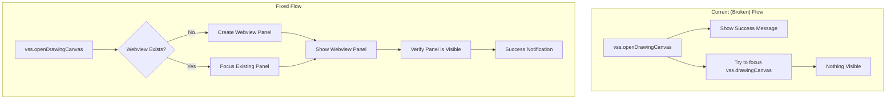

# Design Document

## Overview

The core issue is that the VS Code extension is showing a success notification but the webview panel is not actually visible in the interface. After analyzing the extension code, the problem appears to be in how the webview is being opened and focused. The extension registers a WebviewViewProvider but the command execution only shows a notification instead of properly opening the webview panel.

**Root Cause Analysis:**
1. The `vss.openDrawingCanvas` command shows a success message but doesn't actually open/focus the webview
2. The webview is registered as a view provider but may not be properly associated with a VS Code view container
3. The command uses `vscode.commands.executeCommand('vss.drawingCanvas.focus')` which may not be the correct way to show the webview

**Solution Approach:**
1. Fix the command to properly show the webview panel
2. Ensure the webview is registered in the correct view container (Explorer, Panel, or custom)
3. Add proper error handling and user feedback for webview display issues
4. Implement fallback methods if the primary webview display method fails

## Architecture

### Current vs Fixed Architecture



### Webview Display Methods

**Method 1: WebviewPanel (Recommended)**
- Create a dedicated webview panel that opens in the main editor area
- Provides full control over display, focus, and lifecycle
- Better user experience for drawing canvas

**Method 2: WebviewView in Sidebar**
- Keep current WebviewViewProvider but fix the display logic
- Show in Explorer sidebar or custom view container
- More integrated with VS Code's panel system

**Method 3: Hybrid Approach**
- Use WebviewPanel for main drawing interface
- Keep WebviewView for quick access in sidebar
- Allow users to choose their preferred display method

## Components and Interfaces

### 1. Fixed Command Handler

**Purpose**: Properly open and display the webview panel

**Current Implementation Issue**:
```typescript
// Current broken implementation
const openDrawingCanvasCommand = createCommandHandler('vss.openDrawingCanvas', async () => {
    if (!drawingCanvasProvider) {
        throw new Error('Drawing canvas provider not initialized. Please restart VS Code.');
    }
    await vscode.commands.executeCommand('vss.drawingCanvas.focus'); // This doesn't work
    vscode.window.showInformationMessage('Drawing Canvas opened successfully!'); // Shows but no webview
});
```

**Fixed Implementation**:
```typescript
const openDrawingCanvasCommand = createCommandHandler('vss.openDrawingCanvas', async () => {
    try {
        // Method 1: Try to show existing webview panel
        if (currentWebviewPanel) {
            currentWebviewPanel.reveal(vscode.ViewColumn.One);
            vscode.window.showInformationMessage('Drawing Canvas focused!');
            return;
        }

        // Method 2: Create new webview panel
        currentWebviewPanel = vscode.window.createWebviewPanel(
            'vssDrawingCanvas',
            'VSS Drawing Canvas',
            vscode.ViewColumn.One,
            {
                enableScripts: true,
                retainContextWhenHidden: true,
                localResourceRoots: [context.extensionUri]
            }
        );

        // Set webview content
        currentWebviewPanel.webview.html = getWebviewContent(currentWebviewPanel.webview);

        // Handle panel disposal
        currentWebviewPanel.onDidDispose(() => {
            currentWebviewPanel = undefined;
        });

        vscode.window.showInformationMessage('Drawing Canvas opened successfully!');

    } catch (error) {
        // Fallback: Try to show in sidebar view
        await vscode.commands.executeCommand('workbench.view.explorer');
        await vscode.commands.executeCommand('vss.drawingCanvas.focus');
        throw error; // Re-throw for error handling
    }
});
```

### 2. Webview Content Provider

**Purpose**: Provide HTML content with proper error handling and loading states

**Interface**:
```typescript
function getWebviewContent(webview: vscode.Webview): string {
    try {
        // Get resource URIs for local files
        const scriptUri = webview.asWebviewUri(vscode.Uri.joinPath(extensionUri, 'webview', 'drawing-tools.js'));
        const styleUri = webview.asWebviewUri(vscode.Uri.joinPath(extensionUri, 'webview', 'styles.css'));

        return `<!DOCTYPE html>
        <html lang="en">
        <head>
            <meta charset="UTF-8">
            <meta name="viewport" content="width=device-width, initial-scale=1.0">
            <meta http-equiv="Content-Security-Policy" content="default-src 'none'; style-src ${webview.cspSource} 'unsafe-inline'; script-src ${webview.cspSource} 'unsafe-inline';">
            <title>VSS Drawing Canvas</title>
            <link href="${styleUri}" rel="stylesheet">
        </head>
        <body>
            <div id="loading-screen">
                <div class="spinner"></div>
                <p>Loading Drawing Canvas...</p>
            </div>
            <div id="canvas-container" style="display: none;">
                <!-- Canvas content here -->
            </div>
            <script src="${scriptUri}"></script>
            <script>
                // Initialize canvas and hide loading screen
                document.addEventListener('DOMContentLoaded', function() {
                    setTimeout(() => {
                        document.getElementById('loading-screen').style.display = 'none';
                        document.getElementById('canvas-container').style.display = 'block';
                    }, 500);
                });
            </script>
        </body>
        </html>`;

    } catch (error) {
        return getErrorWebviewContent(error.message);
    }
}

function getErrorWebviewContent(errorMessage: string): string {
    return `<!DOCTYPE html>
    <html lang="en">
    <head>
        <meta charset="UTF-8">
        <title>VSS Error</title>
        <style>
            body { font-family: Arial, sans-serif; padding: 20px; background: #1e1e1e; color: #cccccc; }
            .error { background: #d32f2f; color: white; padding: 15px; border-radius: 5px; margin: 10px 0; }
            .troubleshooting { background: #333; padding: 15px; border-radius: 5px; margin: 10px 0; }
        </style>
    </head>
    <body>
        <h1>VSS Drawing Canvas Error</h1>
        <div class="error">
            <strong>Error:</strong> ${errorMessage}
        </div>
        <div class="troubleshooting">
            <h3>Troubleshooting Steps:</h3>
            <ol>
                <li>Try reloading VS Code (Ctrl+Shift+P → "Developer: Reload Window")</li>
                <li>Check if the extension is properly installed</li>
                <li>Run "VSS: Show Diagnostics" for more information</li>
                <li>Report this issue on GitHub if the problem persists</li>
            </ol>
        </div>
    </body>
    </html>`;
}
```

### 3. Webview Panel Manager

**Purpose**: Manage webview panel lifecycle and state

**Interface**:
```typescript
class WebviewPanelManager {
    private static instance: WebviewPanelManager;
    private currentPanel: vscode.WebviewPanel | undefined;
    private logger: VSSLogger;

    private constructor(private extensionUri: vscode.Uri) {
        this.logger = VSSLogger.getInstance();
    }

    public static getInstance(extensionUri: vscode.Uri): WebviewPanelManager {
        if (!WebviewPanelManager.instance) {
            WebviewPanelManager.instance = new WebviewPanelManager(extensionUri);
        }
        return WebviewPanelManager.instance;
    }

    public async showDrawingCanvas(): Promise<void> {
        try {
            // If panel exists, just reveal it
            if (this.currentPanel) {
                this.currentPanel.reveal(vscode.ViewColumn.One);
                this.logger.info('Existing webview panel revealed');
                return;
            }

            // Create new panel
            this.currentPanel = vscode.window.createWebviewPanel(
                'vssDrawingCanvas',
                'VSS Drawing Canvas',
                vscode.ViewColumn.One,
                {
                    enableScripts: true,
                    retainContextWhenHidden: true,
                    localResourceRoots: [this.extensionUri]
                }
            );

            // Set up panel content and event handlers
            this.setupWebviewPanel();
            this.logger.info('New webview panel created and configured');

        } catch (error) {
            this.logger.error('Failed to show drawing canvas', { error });
            throw error;
        }
    }

    private setupWebviewPanel(): void {
        if (!this.currentPanel) return;

        // Set webview content
        this.currentPanel.webview.html = getWebviewContent(this.currentPanel.webview);

        // Handle messages from webview
        this.currentPanel.webview.onDidReceiveMessage(
            message => this.handleWebviewMessage(message),
            undefined,
            []
        );

        // Handle panel disposal
        this.currentPanel.onDidDispose(() => {
            this.currentPanel = undefined;
            this.logger.info('Webview panel disposed');
        });

        // Handle panel visibility changes
        this.currentPanel.onDidChangeViewState(e => {
            this.logger.info('Webview panel visibility changed', { 
                visible: e.webviewPanel.visible,
                active: e.webviewPanel.active 
            });
        });
    }

    private handleWebviewMessage(message: any): void {
        this.logger.info('Received webview message', { command: message.command });
        
        switch (message.command) {
            case 'canvasReady':
                vscode.window.showInformationMessage('Drawing Canvas is ready!');
                break;
            case 'error':
                this.logger.error('Webview error', { error: message.data });
                vscode.window.showErrorMessage(`Canvas Error: ${message.data.message}`);
                break;
            default:
                this.logger.debug('Unknown webview message', { message });
        }
    }

    public isVisible(): boolean {
        return this.currentPanel?.visible ?? false;
    }

    public dispose(): void {
        if (this.currentPanel) {
            this.currentPanel.dispose();
            this.currentPanel = undefined;
        }
    }
}
```

### 4. Alternative Display Methods

**Sidebar View (Fallback)**:
```typescript
// Keep existing WebviewViewProvider as fallback
class DrawingCanvasViewProvider implements vscode.WebviewViewProvider {
    public resolveWebviewView(webviewView: vscode.WebviewView): void {
        webviewView.webview.options = {
            enableScripts: true,
            localResourceRoots: [this.extensionUri]
        };

        webviewView.webview.html = getWebviewContent(webviewView.webview);
        
        // Make sure the view is visible
        webviewView.show?.(true); // Show with focus if method exists
    }
}

// Register in package.json views
"views": {
    "explorer": [
        {
            "id": "vss.drawingCanvas",
            "name": "Drawing Canvas",
            "when": "vss.enabled"
        }
    ]
}
```

## Data Models

### Webview State Management

```typescript
interface WebviewState {
    isVisible: boolean;
    isReady: boolean;
    lastError?: string;
    canvasData?: {
        width: number;
        height: number;
        drawings: any[];
    };
}

interface WebviewMessage {
    command: 'canvasReady' | 'error' | 'drawing' | 'toolChanged';
    data?: any;
}

interface WebviewConfig {
    enableScripts: boolean;
    retainContextWhenHidden: boolean;
    localResourceRoots: vscode.Uri[];
}
```

## Error Handling

### Webview Display Failures

**Primary Method Failure**:
1. Try to create WebviewPanel
2. If fails, fall back to WebviewView in sidebar
3. If both fail, show detailed error message with troubleshooting steps

**Content Loading Failures**:
1. Detect HTML/JavaScript errors in webview
2. Show error page with diagnostic information
3. Provide retry mechanism and troubleshooting steps

**Communication Failures**:
1. Handle postMessage failures between webview and extension
2. Implement timeout for webview ready confirmation
3. Show connection status in webview interface

### User Experience Improvements

**Loading States**:
- Show loading spinner while webview initializes
- Provide progress feedback for slow loading
- Hide loading screen once canvas is ready

**Error Recovery**:
- Automatic retry for transient failures
- Manual retry button for persistent issues
- Clear error messages with actionable steps

**Fallback Options**:
- Multiple display methods (panel, sidebar, new window)
- Graceful degradation if features are unavailable
- Alternative interfaces for different VS Code versions

## Testing Strategy

### Manual Testing Steps

1. **Basic Functionality**:
   - Run "VSS: Open Drawing Canvas" command
   - Verify webview panel appears in main editor area
   - Confirm canvas interface is visible and interactive

2. **Error Scenarios**:
   - Test with corrupted webview content
   - Test with disabled JavaScript
   - Test with restricted Content Security Policy

3. **Multiple Instances**:
   - Open canvas multiple times
   - Verify only one panel exists
   - Test focus behavior

### Automated Testing

```typescript
// Test webview panel creation
suite('Webview Display Tests', () => {
    test('should create webview panel when command executed', async () => {
        await vscode.commands.executeCommand('vss.openDrawingCanvas');
        // Assert panel exists and is visible
    });

    test('should focus existing panel if already open', async () => {
        // Create panel, then run command again
        // Assert same panel is focused, not new one created
    });

    test('should show error message if webview fails to load', async () => {
        // Mock webview creation failure
        // Assert error message is shown
    });
});
```

## Security Considerations

### Content Security Policy
- Restrict script sources to extension resources only
- Allow inline styles for dynamic theming
- Prevent external resource loading

### Resource Access
- Limit local resource roots to extension directory
- Validate all file paths before loading
- Sanitize any user-generated content

### Message Passing
- Validate all messages from webview
- Sanitize message data before processing
- Implement message rate limiting if needed