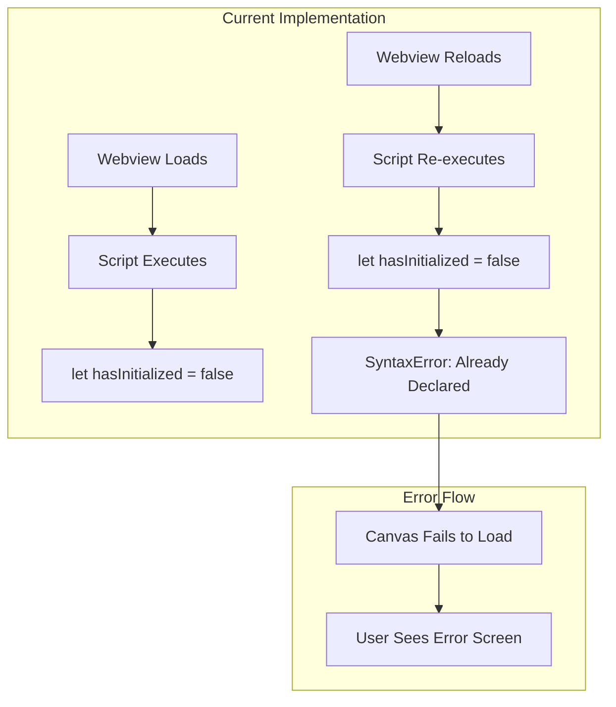
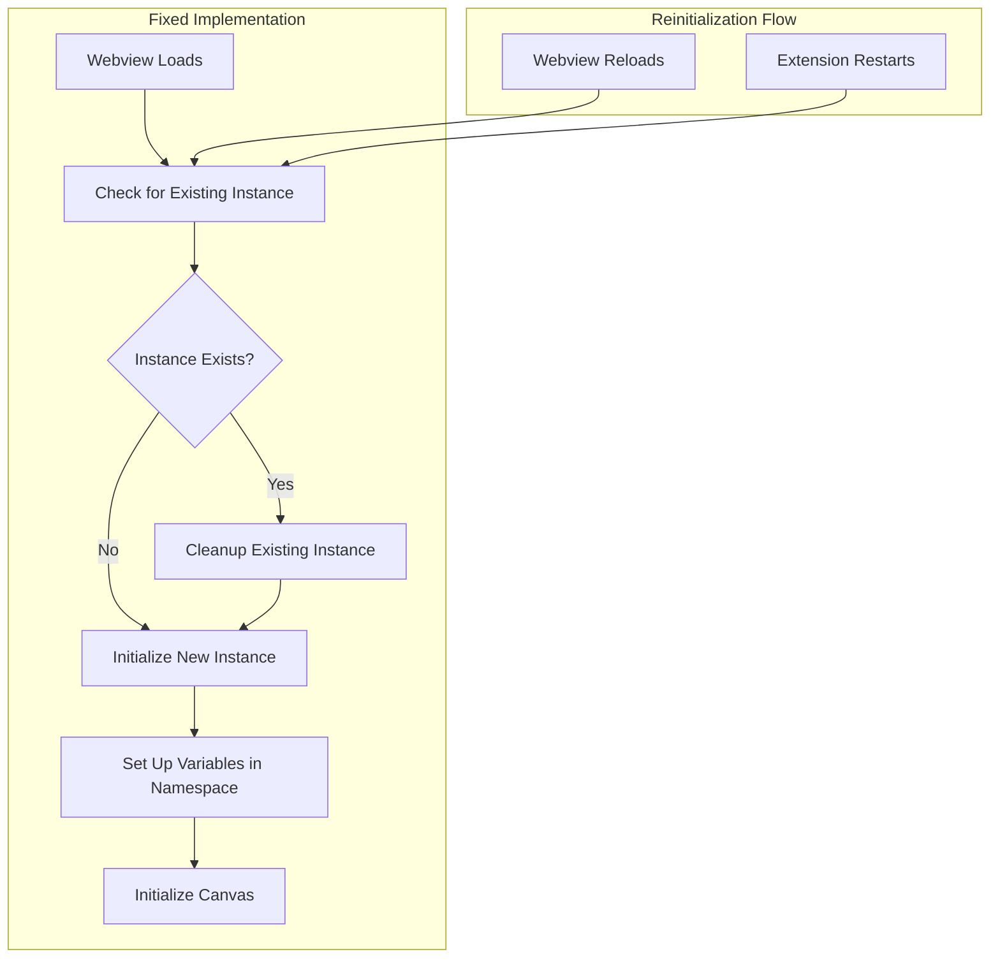

# Design Document

## Overview

The webview initialization error is caused by JavaScript variable redeclaration when the webview script executes multiple times. This commonly happens in VS Code webviews due to:

1. **Webview Reloading**: VS Code may reload webviews during development or when the extension restarts
2. **Multiple Script Execution**: The same script block may execute multiple times without proper cleanup
3. **Global Variable Conflicts**: Variables declared with `let`/`const` in the global scope cannot be redeclared

**Root Cause Analysis:**
- The `hasInitialized` variable is declared with `let` in the global scope
- When the webview reloads or the script re-executes, it attempts to redeclare the same variable
- JavaScript's block scoping rules prevent redeclaration of `let`/`const` variables in the same scope

**Solution Approach:**
1. Implement proper variable scoping using IIFE (Immediately Invoked Function Expression)
2. Add existence checks before variable declaration
3. Use a namespace pattern to avoid global variable conflicts
4. Implement proper cleanup and reinitialization logic

## Architecture

### Current Problem Pattern



### Proposed Solution Architecture



## Components and Interfaces

### 1. Namespace Pattern Implementation

**Purpose**: Encapsulate all webview variables and functions in a single namespace to prevent global conflicts.

**Implementation:**
```javascript
// Create or reuse existing namespace
window.VSSCanvas = window.VSSCanvas || {};

// Check if already initialized and cleanup if needed
if (window.VSSCanvas.initialized) {
    window.VSSCanvas.cleanup();
}

// Initialize namespace with all variables
window.VSSCanvas = {
    initialized: false,
    canvas: null,
    ctx: null,
    isDrawing: false,
    currentTool: 'pen',
    lastX: 0,
    lastY: 0,
    initializationTimeout: null,
    
    // Initialization method
    init: function() {
        if (this.initialized) {
            console.log('VSSCanvas already initialized, reinitializing...');
            this.cleanup();
        }
        
        this.setupCanvas();
        this.setupEventListeners();
        this.setupMessagePassing();
        this.initialized = true;
    },
    
    // Cleanup method
    cleanup: function() {
        if (this.initializationTimeout) {
            clearTimeout(this.initializationTimeout);
        }
        
        // Remove event listeners
        this.removeEventListeners();
        
        // Clear canvas context
        if (this.ctx && this.canvas) {
            this.ctx.clearRect(0, 0, this.canvas.width, this.canvas.height);
        }
        
        this.initialized = false;
    }
};
```

### 2. IIFE (Immediately Invoked Function Expression) Wrapper

**Purpose**: Create a local scope for all webview code to prevent global variable conflicts.

**Implementation:**
```javascript
(function() {
    'use strict';
    
    // All variables are now in local scope
    let hasInitialized = false;
    let canvas, ctx;
    let isDrawing = false;
    // ... other variables
    
    // Check if we need to reinitialize
    if (window.VSSCanvasInstance) {
        console.log('Cleaning up previous instance...');
        window.VSSCanvasInstance.cleanup();
    }
    
    // Create new instance
    window.VSSCanvasInstance = {
        cleanup: function() {
            // Cleanup logic
        },
        
        isInitialized: function() {
            return hasInitialized;
        }
    };
    
    // Initialize when DOM is ready
    document.addEventListener('DOMContentLoaded', function() {
        if (!hasInitialized) {
            initializeCanvas();
        }
    });
    
})(); // Execute immediately
```

### 3. Existence Check Pattern

**Purpose**: Check for existing variables/instances before creating new ones.

**Implementation:**
```javascript
// Method 1: Check and cleanup existing instance
if (typeof window.canvasInitialized !== 'undefined') {
    console.log('Canvas already initialized, cleaning up...');
    // Perform cleanup
    delete window.canvasInitialized;
}

// Method 2: Use try-catch for variable declaration
try {
    let hasInitialized = false;
} catch (e) {
    if (e instanceof SyntaxError && e.message.includes('already been declared')) {
        console.log('Variable already exists, using existing instance');
        // Use existing variable
    } else {
        throw e; // Re-throw if it's a different error
    }
}

// Method 3: Use var instead of let for global variables (less preferred)
var hasInitialized = hasInitialized || false;
```

### 4. Robust Initialization System

**Purpose**: Handle initialization, reinitialization, and error recovery gracefully.

**Implementation:**
```javascript
class VSSCanvasManager {
    constructor() {
        this.initialized = false;
        this.canvas = null;
        this.ctx = null;
        this.eventListeners = [];
        this.initializationTimeout = null;
    }
    
    async init() {
        try {
            // Cleanup any existing instance
            if (this.initialized) {
                await this.cleanup();
            }
            
            // Set initialization timeout
            this.initializationTimeout = setTimeout(() => {
                if (!this.initialized) {
                    this.showError('Initialization timeout - Canvas failed to load within 10 seconds');
                }
            }, 10000);
            
            // Initialize components
            await this.initializeCanvas();
            await this.setupEventListeners();
            await this.setupMessagePassing();
            
            // Mark as initialized
            this.initialized = true;
            clearTimeout(this.initializationTimeout);
            
            console.log('VSSCanvas initialized successfully');
            
        } catch (error) {
            console.error('VSSCanvas initialization failed:', error);
            this.showError('Initialization failed: ' + error.message, error.stack);
        }
    }
    
    async cleanup() {
        // Clear timeout
        if (this.initializationTimeout) {
            clearTimeout(this.initializationTimeout);
        }
        
        // Remove event listeners
        this.eventListeners.forEach(({ element, event, handler }) => {
            element.removeEventListener(event, handler);
        });
        this.eventListeners = [];
        
        // Clear canvas
        if (this.ctx && this.canvas) {
            this.ctx.clearRect(0, 0, this.canvas.width, this.canvas.height);
        }
        
        // Reset state
        this.initialized = false;
        this.canvas = null;
        this.ctx = null;
        
        console.log('VSSCanvas cleaned up');
    }
    
    addEventListener(element, event, handler) {
        element.addEventListener(event, handler);
        this.eventListeners.push({ element, event, handler });
    }
    
    // ... other methods
}

// Global instance management
if (window.vssCanvasManager) {
    window.vssCanvasManager.cleanup();
}
window.vssCanvasManager = new VSSCanvasManager();
```

## Data Models

### Canvas State Management

```javascript
interface CanvasState {
    initialized: boolean;
    canvas: HTMLCanvasElement | null;
    ctx: CanvasRenderingContext2D | null;
    isDrawing: boolean;
    currentTool: string;
    lastX: number;
    lastY: number;
    initializationTimeout: number | null;
}

interface EventListenerRecord {
    element: EventTarget;
    event: string;
    handler: EventListener;
}

interface InitializationOptions {
    timeout: number;
    enableErrorRecovery: boolean;
    enableLogging: boolean;
    autoCleanup: boolean;
}
```

### Error Handling Types

```javascript
interface InitializationError {
    type: 'DUPLICATE_DECLARATION' | 'TIMEOUT' | 'CANVAS_ERROR' | 'CONTEXT_ERROR';
    message: string;
    stack?: string;
    recoverable: boolean;
}

interface RecoveryStrategy {
    strategy: string;
    message: string;
    autoRecover: boolean;
    action?: () => void;
}
```

## Error Handling

### Initialization Error Recovery

**Error Types and Strategies:**

1. **Duplicate Declaration Error**:
   - Strategy: Use namespace pattern or IIFE
   - Recovery: Cleanup existing instance and reinitialize
   - Auto-recover: Yes

2. **Canvas Context Error**:
   - Strategy: Recreate canvas element
   - Recovery: Clear existing canvas and create new context
   - Auto-recover: Yes

3. **Initialization Timeout**:
   - Strategy: Show error with retry option
   - Recovery: Allow manual retry with extended timeout
   - Auto-recover: No (requires user action)

4. **Event Listener Conflicts**:
   - Strategy: Remove existing listeners before adding new ones
   - Recovery: Track and cleanup all event listeners
   - Auto-recover: Yes

### Implementation Example

```javascript
class ErrorRecoveryManager {
    constructor(canvasManager) {
        this.canvasManager = canvasManager;
        this.recoveryStrategies = new Map();
        this.setupRecoveryStrategies();
    }
    
    setupRecoveryStrategies() {
        this.recoveryStrategies.set('DUPLICATE_DECLARATION', {
            strategy: 'cleanup_and_reinit',
            message: 'Variable conflict detected. Cleaning up and reinitializing...',
            autoRecover: true,
            action: () => this.canvasManager.cleanup().then(() => this.canvasManager.init())
        });
        
        this.recoveryStrategies.set('CANVAS_ERROR', {
            strategy: 'recreate_canvas',
            message: 'Canvas error detected. Recreating canvas element...',
            autoRecover: true,
            action: () => this.recreateCanvas()
        });
    }
    
    async handleError(error) {
        const strategy = this.recoveryStrategies.get(error.type);
        
        if (strategy && strategy.autoRecover) {
            console.log(`Auto-recovering from ${error.type}: ${strategy.message}`);
            try {
                await strategy.action();
                return true;
            } catch (recoveryError) {
                console.error('Recovery failed:', recoveryError);
                return false;
            }
        }
        
        return false;
    }
}
```

## Testing Strategy

### Unit Testing Approach

**Test Categories:**
1. **Initialization Tests**: Verify clean initialization and reinitialization
2. **Cleanup Tests**: Ensure proper resource cleanup
3. **Error Recovery Tests**: Test error handling and recovery mechanisms
4. **Variable Scoping Tests**: Verify no global variable conflicts

**Test Implementation:**
```javascript
suite('Webview Initialization Tests', () => {
    let canvasManager;
    
    setup(() => {
        // Clean up any existing instances
        if (window.vssCanvasManager) {
            window.vssCanvasManager.cleanup();
        }
        canvasManager = new VSSCanvasManager();
    });
    
    teardown(() => {
        if (canvasManager) {
            canvasManager.cleanup();
        }
    });
    
    test('should initialize without errors', async () => {
        await canvasManager.init();
        assert.strictEqual(canvasManager.initialized, true);
    });
    
    test('should handle reinitialization gracefully', async () => {
        await canvasManager.init();
        await canvasManager.init(); // Second initialization
        assert.strictEqual(canvasManager.initialized, true);
    });
    
    test('should cleanup resources properly', async () => {
        await canvasManager.init();
        await canvasManager.cleanup();
        assert.strictEqual(canvasManager.initialized, false);
        assert.strictEqual(canvasManager.eventListeners.length, 0);
    });
});
```

### Integration Testing

**Webview Lifecycle Tests:**
1. Test webview loading and initialization
2. Test webview reloading scenarios
3. Test extension restart scenarios
4. Test multiple webview instances

**Manual Testing Steps:**
1. Open VS Code extension
2. Open webview canvas
3. Reload webview (Ctrl+R in webview)
4. Restart extension
5. Open multiple webview instances
6. Verify no JavaScript errors in console

## Performance Considerations

### Memory Management
- Proper cleanup of event listeners prevents memory leaks
- Canvas context cleanup prevents GPU memory accumulation
- Timeout cleanup prevents timer leaks

### Initialization Performance
- Lazy initialization of non-critical components
- Efficient existence checks to avoid unnecessary work
- Minimal DOM manipulation during initialization

### Error Recovery Performance
- Fast error detection and recovery
- Minimal impact on normal operation
- Efficient cleanup and reinitialization

## Security Considerations

### Variable Scoping Security
- Prevent global namespace pollution
- Avoid exposing internal variables to other scripts
- Use strict mode to catch potential security issues

### Error Information Security
- Sanitize error messages before displaying to users
- Avoid exposing sensitive information in error logs
- Secure communication with VS Code extension

## Migration Strategy

### Backward Compatibility
- Maintain existing API surface for canvas operations
- Preserve all existing functionality
- Ensure smooth transition without user impact

### Rollout Plan
1. **Phase 1**: Implement namespace pattern and IIFE wrapper
2. **Phase 2**: Add robust initialization and cleanup logic
3. **Phase 3**: Implement error recovery mechanisms
4. **Phase 4**: Add comprehensive testing and monitoring