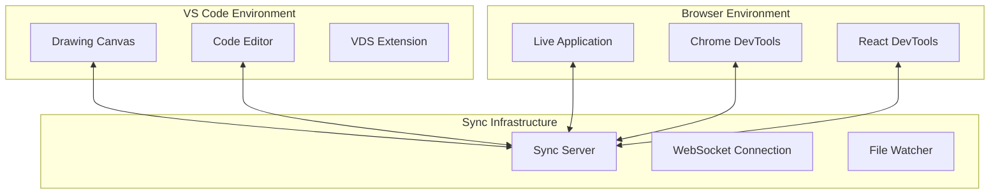

# Visual Design Sync (VDS) Documentation

Complete documentation for the Visual Design Sync extension - the revolutionary three-way synchronization system between drawing canvas, VS Code editor, and live Chrome application.

## 📚 Documentation Sections

### 🚀 Getting Started
- **[Installation Guide](./installation.md)** - Installing and setting up VDS
- **[Quick Start](./quick-start.md)** - Your first VDS project in 5 minutes
- **[System Requirements](./system-requirements.md)** - Hardware and software requirements

### 🎨 User Guide
- **[Drawing Canvas](./user-guide/drawing-canvas.md)** - Professional drawing tools and features
- **[Three-Way Sync](./user-guide/three-way-sync.md)** - Understanding the sync workflow
- **[Component Generation](./user-guide/component-generation.md)** - From drawings to React components
- **[Design Tokens](./user-guide/design-tokens.md)** - Generating design system tokens

### 🔧 Developer Guide
- **[Extension API](./developer-guide/extension-api.md)** - VDS extension APIs and customization
- **[Sync Server](./developer-guide/sync-server.md)** - Understanding and extending the sync server
- **[Code Generation](./developer-guide/code-generation.md)** - Customizing CSS and component generation
- **[Plugin Development](./developer-guide/plugin-development.md)** - Creating VDS plugins

### 🎯 Advanced Topics
- **[Tablet Workflows](./advanced/tablet-workflows.md)** - Apple Pencil and Wacom optimization
- **[Cross-Platform Development](./advanced/cross-platform.md)** - iPad + Codespaces workflows
- **[Performance Optimization](./advanced/performance.md)** - Optimizing sync performance
- **[Enterprise Deployment](./advanced/enterprise.md)** - Team and enterprise setup

### 🔌 Framework Integration
- **[React Integration](./frameworks/react.md)** - React-specific features and patterns
- **[Next.js Integration](./frameworks/nextjs.md)** - VDS with Next.js projects
- **[Material-UI Integration](./frameworks/material-ui.md)** - Generating Material-UI themes
- **[Tailwind CSS Integration](./frameworks/tailwind.md)** - Custom utility class generation

### 🐛 Troubleshooting
- **[Common Issues](./troubleshooting/common-issues.md)** - Solutions to frequent problems
- **[Performance Issues](./troubleshooting/performance.md)** - Diagnosing and fixing performance problems
- **[Sync Problems](./troubleshooting/sync-problems.md)** - Resolving synchronization issues
- **[Platform-Specific Issues](./troubleshooting/platform-specific.md)** - OS and device-specific solutions

## 🎥 Video Documentation

### Tutorial Videos
- **VDS Overview** (5 min) - Introduction to three-way sync
- **First Project Setup** (10 min) - Complete project walkthrough
- **Drawing Tools Mastery** (15 min) - Professional drawing techniques
- **Advanced Workflows** (20 min) - Complex design system creation

### Feature Demonstrations
- **Apple Pencil Workflow** - Tablet-optimized design process
- **Cross-Platform Development** - iPad + Codespaces setup
- **Real-Time Collaboration** - Team workflows and sharing

## 📖 API Reference

### Extension APIs
- **[Drawing Canvas API](./api/drawing-canvas.md)** - Canvas manipulation and events
- **[Sync Server API](./api/sync-server.md)** - WebSocket protocol and events
- **[Code Generation API](./api/code-generation.md)** - Customizing output generation
- **[Plugin API](./api/plugin-api.md)** - Creating extensions and plugins

### WebSocket Protocol
- **[Message Types](./api/websocket-protocol.md)** - Complete protocol documentation
- **[Event Handling](./api/event-handling.md)** - Custom event processing
- **[Error Codes](./api/error-codes.md)** - Error handling and recovery

## 🏗️ Architecture

### System Overview

### Component Architecture
- **[Extension Architecture](./architecture/extension.md)** - VS Code extension structure
- **[Sync Server Architecture](./architecture/sync-server.md)** - Server design and patterns
- **[Code Generation Pipeline](./architecture/code-generation.md)** - From design to code flow

## 🚀 Examples and Templates

### Example Projects
- **[Basic Button](../examples/basic-button/)** - Simple component creation
- **[Design System Dashboard](../examples/design-system-dashboard/)** - Complex design systems
- **[E-commerce Cards](../examples/ecommerce-cards/)** - Data-driven components
- **[Mobile Landing](../examples/mobile-landing/)** - Responsive design

### Project Templates
- **[React Starter](./templates/react-starter.md)** - Basic React + VDS setup
- **[Next.js Template](./templates/nextjs-template.md)** - Next.js integration
- **[Design System Template](./templates/design-system.md)** - Complete design system
- **[Mobile App Template](./templates/mobile-app.md)** - Mobile-first development

## 🤝 Contributing

### Development Setup
- **[Development Environment](./contributing/development-setup.md)** - Setting up for VDS development
- **[Building from Source](./contributing/building.md)** - Compiling and testing
- **[Testing Guidelines](./contributing/testing.md)** - Test requirements and procedures

### Contribution Guidelines
- **[Code Style](./contributing/code-style.md)** - Coding standards and conventions
- **[Pull Request Process](./contributing/pull-requests.md)** - How to contribute code
- **[Documentation Guidelines](./contributing/documentation.md)** - Writing and updating docs

## 📄 License and Legal

- **[License](../LICENSE.md)** - MIT License terms
- **[Privacy Policy](./legal/privacy.md)** - Data handling and privacy
- **[Terms of Service](./legal/terms.md)** - Usage terms and conditions
- **[Third-Party Licenses](./legal/third-party.md)** - Dependencies and attributions

## 🆘 Support

### Community Support
- **[Discord Community](https://discord.gg/vds)** - Live chat and help
- **[GitHub Discussions](https://github.com/vds/discussions)** - Technical discussions
- **[Stack Overflow](https://stackoverflow.com/questions/tagged/visual-design-sync)** - Q&A with the community

### Professional Support
- **[Enterprise Support](./support/enterprise.md)** - Professional support options
- **[Training Services](./support/training.md)** - Team training and workshops
- **[Consulting Services](./support/consulting.md)** - Custom implementation help

### Bug Reports and Feature Requests
- **[Bug Report Template](./support/bug-report.md)** - How to report issues
- **[Feature Request Template](./support/feature-request.md)** - Requesting new features
- **[Security Issues](./support/security.md)** - Reporting security vulnerabilities

---

## Quick Navigation

| I want to... | Go to... |
|---------------|----------|
| Get started quickly | [Quick Start Guide](./quick-start.md) |
| Learn the drawing tools | [Drawing Canvas Guide](./user-guide/drawing-canvas.md) |
| Understand three-way sync | [Three-Way Sync Guide](./user-guide/three-way-sync.md) |
| Customize code generation | [Code Generation API](./api/code-generation.md) |
| Use with my framework | [Framework Integration](./frameworks/) |
| Optimize performance | [Performance Guide](./advanced/performance.md) |
| Report a bug | [Bug Report](./support/bug-report.md) |
| Request a feature | [Feature Request](./support/feature-request.md) |

---

**Visual Design Sync** - Bridging the gap between design and development with revolutionary three-way synchronization.